# Diagrama de clases

Representa las clases del sistema y las relaciones entre ellas.

En un diagrama de clases podemos encontrar los siguientes elementos:
- Clases: son abstracciones del dominio del sistema que representan elementos del mismo mediante un estado (campos) y un comportamiento (métodos). Los campos y métodos tienen una visibilidad que determina quién puede acceder a ellos.
- Relaciones: pueden ser de herencia, composición y agragación (entre otras).

## Clases
La representación de una clase en UML consiste en una caja con tres compartimentos: nombre, campos y métodos.
- Nombre de la clase
- Campos: se espcifica primero el tipo y luego el nombre
- Métodos: se especifica el nombre, los paràmetros entre paréntesis, y opcionalmente después de dos puntos el tipo de retorno.

Para describir la visibilidad de los miembros de la clase se deben colocar antes del nombre los siguientes símbolos:
- `+` Public
- `-` Private
- `#` Protected
- `~` Package

Se pueden incluir los siguientes *clasificadores* añadiendo al final los siguientes símbolos:
- `*` Abstract
- `$` Static


Ejemplo:

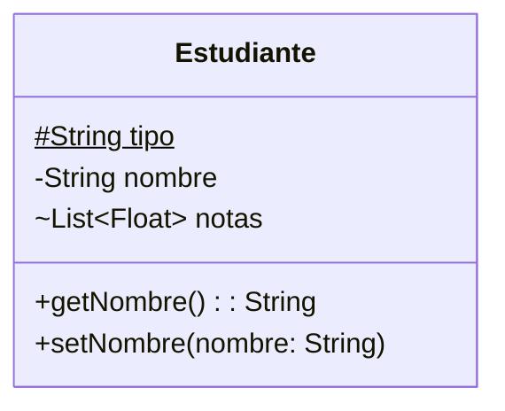

```java
class Estudiante {
    static protected String tipo;
    private String nombre;
    List<Float> notas;
  
    public String getNombre(){ 
        return nombre;
    }
  
    public void setNombre(String nombre){
        this.nombre = nombre;
    }
}
```


## Relaciones

UML define diversos tipos de relaciones entre clases. Destacaremos los siguientes:

### Herencia
_"es un tipo de"_
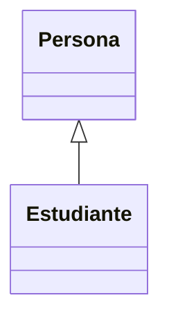
```java
class Persona {}

class Estudiante extends Persona {}
```
### Realización
_"actua como"_
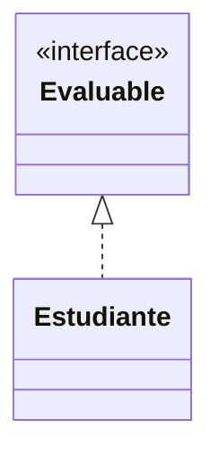
```java
interface Evaluable {}

class Estudiante implements Evaluable {}
```

### Agregación
_"tiene"_
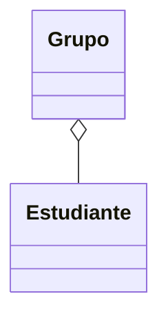
```java
class Grupo {
    List<Estudiante> estudiantes;
}

class Estudiante {}
```

### Composición
_"es parte de"_
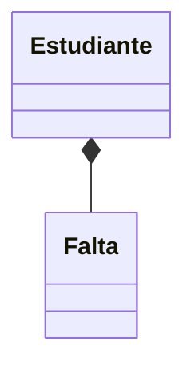
```java
class Estudiante {
    class Falta {
        LocalDate fecha;
        boolean justificada;
    }

    List<Falta> faltas;
}
```

# Diagrama de secuencia
Representa los mensajes que fluyen en el sistema, quién los envía y quién los recibe, y en qué orden.

En un diagrama de secuencia encontramos:
- Lineas de vida: representan los participantes (actores, roles u objetos) del proceso modelado.
- Mensajes: representan la información transmitida entre los participantes.
- Activaciones: representan el tiempo que necesita un participante para completar una tarea.

## Lineas de vida
Los participantes se colocan en cajas. La línea vertical indica el paso del tiempo hacia abajo.

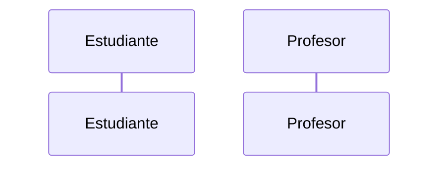

## Mensajes
Los mensajes suelen ser las llamadas a métodos y los retornos (aunque tambień pueden ser llamadas a APIs u otros tipos de paso de mensajes).


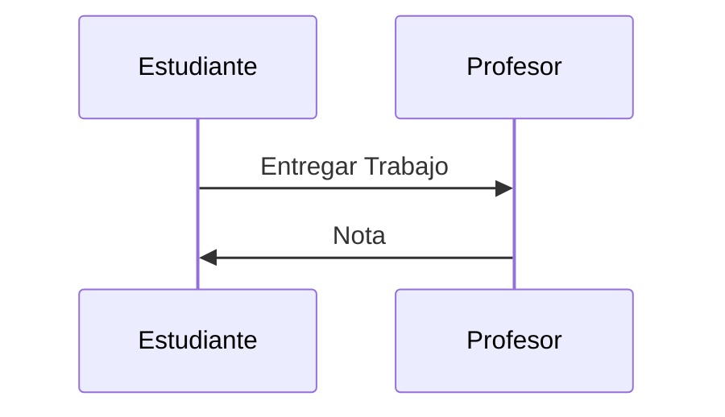
```java
class Profesor {
    static float entregarTrabajo(String trabajo) {
        return new Random().nextFloat(10);
    }
}

class Estudiante {
    static void hacerTodoLoPosibleParaAprobar(){
        float nota = Profesor.entregarTrabajo("sequenceDiagram");
    }
}
```

Existen diversos tipos de mensajes:

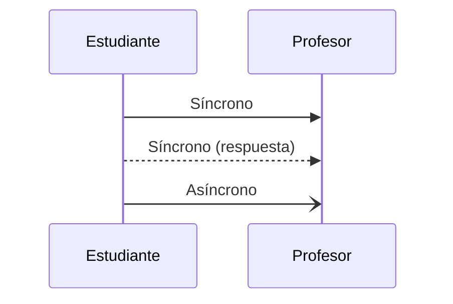

## Activaciones

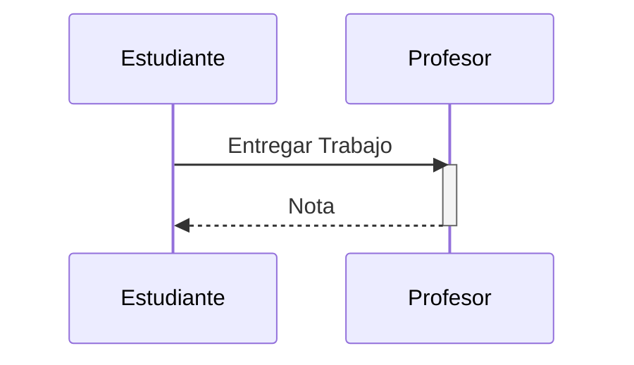

# Diagrama de actividades

También llamado diagrama de flujo (_Flowchart_). Representa una serie de acciones en un sistema.

En un diagrama de actividades encontramos:

- Actividades: son tareas que se realizan en el sistema
- Transiciones: conectan una tarea con la siguiente tarea a realizar
- Decisiones: representan una condicion que determina la siguiente tarea a realizar entre varias posibilidades
- Combinaciones: permite que se inicien varias tareas a continuación de una tarea (divergencia), o que una tarea se inicia después de finalizar varias tareas (convergencia)

## Actividades

Se representan con una caja con el nombre de la actividad dentro

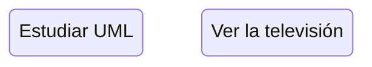

## Transiciones

Se representan con una flecha que une una actividad con la siguiente

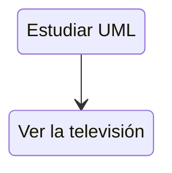

## Decisiones

Se representan con un rombo con la descripción de la condición. De él salen varias flechas hacia las siguientes actividades, y en cada flecha se indica el resultado de la condición.

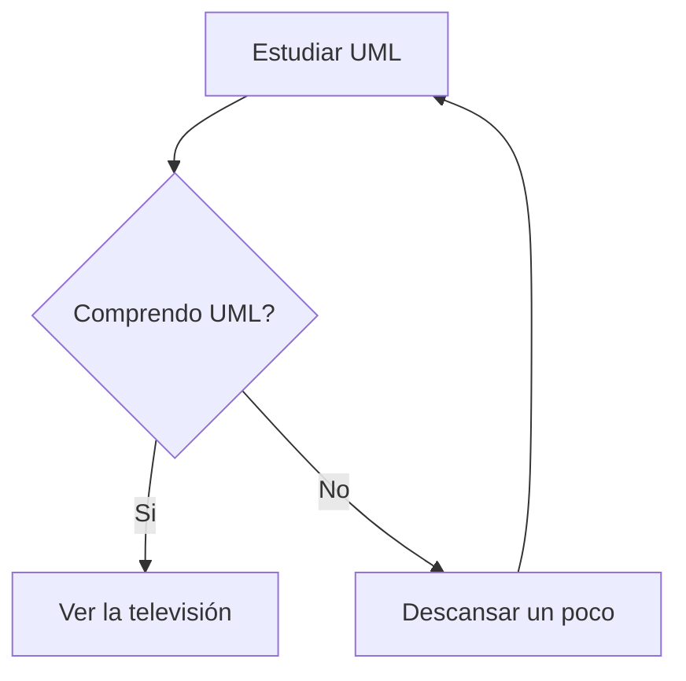

## Combinaciones

Se representan con una barra de color negro. De una barra de divergencia (_fork_) salen varias flechas. A un barra de convergencia (_join_) entran varias flechas.

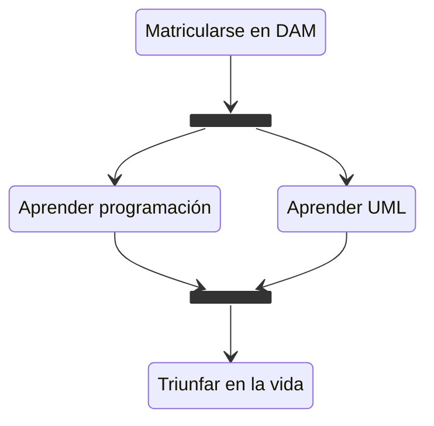


# Diagrama de estados

Estados, eventos, señales, transiciones.
