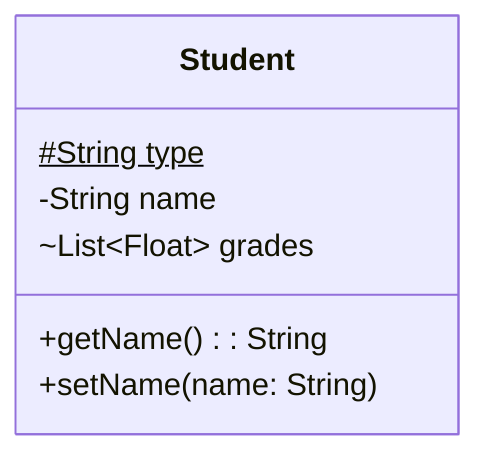

# Diagrama de clases

Describe la estructura de un sistema al mostrar las clases del sistema, su estado (campos) y su comportamiento (métodos), y las relaciones entre ellas.

En un diagrama de clases podemos encontrar los siguientes elementos:
- Clases: son abstracciones del dominio del sistema que representan elementos del mismo mediante un estado (campos) y un comportamiento (métodos). Los campos y métodos tienen una visibilidad que determina quién puede acceder a ellos.
- Relaciones: en el diagrama representan relaciones reales entre los elementos del sistema a los que hacen referencia las clases. Pueden ser de herencia, composición y agragación (entre otras).

## Clases
La representación de una clase en UML consiste en una caja con tres compartimentos: nombre, campos y métodos.
- Nombre de la clase
- Campos: se espcifica primero el tipo y luego el nombre
- Métodos: se especifica el nombre, los paràmetros entre paréntesis, y opcionalmente después de dos puntos el tipo de retorno.

Para describir la visibilidad de los miembros de la clase se deben colocar antes del nombre los siguientes símbolos:
- `+` Public
- `-` Private
- `#` Protected
- `~` Package

Se pueden incluir los siguientes *clasificadores* añadiendo al final los siguientes símbolos:
- `*` Abstract
- `$` Static


Ejemplo:


```java
class Student {
  static protected String type;
  private String name;
  List<Float> grades;
  
  public String getName(){ 
    return name;
  }
  
  public void setName(String name){
    this.name = name;
  }
}
```





## Relaciones

UML define diversos tipos de relaciones entre clases. Destacaremos los siguientes:

<table>
<tr>
<td>
Herencia<br>
<em>"es un tipo de"</em>
</td>
<td>
<pre lang="mermaid">
classDiagram
Persona <|-- Estudiante
</pre>
</td>
<td>

```java
class Persona {}

class Estudiante extends Persona {}
```

</td>
</tr>


<tr>
<td>
Realización<br>
<em>"actua como"</em>
</td>
<td>
<pre lang="mermaid">
classDiagram
Evaluable <|.. Estudiante
</pre>
</td>
<td>

```java
interface Evaluable {}

class Estudiante implements Evaluable {}
```

</td>
</tr>


<tr>
<td>
Agregación<br>
<em>"tiene"</em>
</td>
<td>
<pre lang="mermaid">
classDiagram
Grupo o-- Estudiante
</pre>
</td>
<td>

```java
class Grupo {
  List<Estudiante> estudiantes;
}

class Estudiante {}
```

</td>
</tr>


<tr>
<td>
Composición<br>
<em>"es parte de"</em>
</td>
<td>
<pre lang="mermaid">
classDiagram
Estudiante *-- Falta
</pre>
</td>
<td>

```java
class Estudiante {
  class Falta {
    LocalDate fecha;
    boolean justificada;
  }

  List<Falta> faltas;
}

```

</td>
</tr>
</table>

# Diagrama de secuencia
Representan los mensajes que fluyen en el sistema, quién los envía y quién los recibe, y en qué orden.

En un diagrama de secuencia encontramos:
- Lineas de vida: representan los participantes (actores, roles u objetos) del proceso modelado.
- Mensajes: representan la información transmitida entre los participantes.
- Activaciones: representan el tiempo que necesita un participante para completar una tarea.

## Lineas de vida

<pre lang="mermaid">
sequenceDiagram
    participant Alice
</pre>

