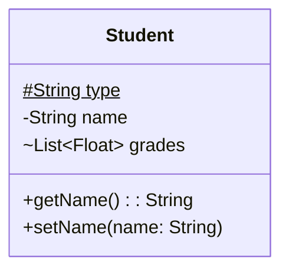
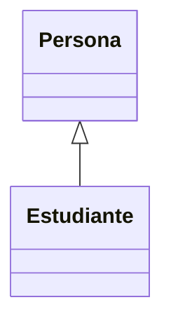
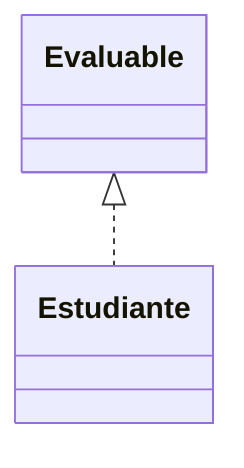
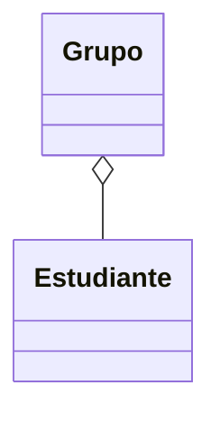
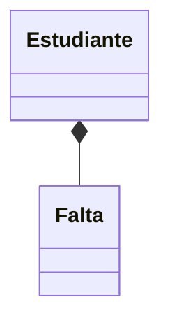
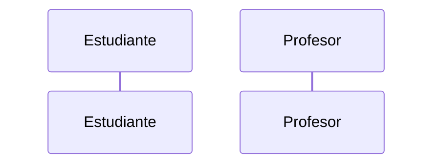
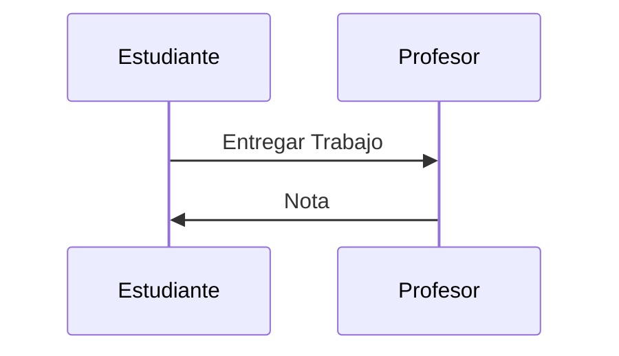
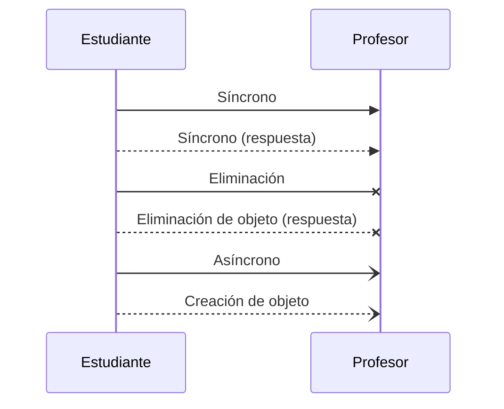
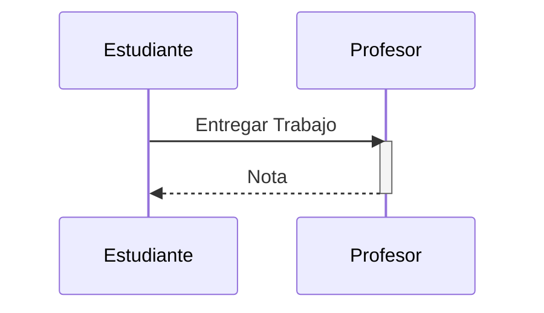

# Diagrama de clases

Describe la estructura de un sistema al mostrar las clases del sistema, su estado (campos) y su comportamiento (métodos), y las relaciones entre ellas.

En un diagrama de clases podemos encontrar los siguientes elementos:
- Clases: son abstracciones del dominio del sistema que representan elementos del mismo mediante un estado (campos) y un comportamiento (métodos). Los campos y métodos tienen una visibilidad que determina quién puede acceder a ellos.
- Relaciones: en el diagrama representan relaciones reales entre los elementos del sistema a los que hacen referencia las clases. Pueden ser de herencia, composición y agragación (entre otras).

## Clases
La representación de una clase en UML consiste en una caja con tres compartimentos: nombre, campos y métodos.
- Nombre de la clase
- Campos: se espcifica primero el tipo y luego el nombre
- Métodos: se especifica el nombre, los paràmetros entre paréntesis, y opcionalmente después de dos puntos el tipo de retorno.

Para describir la visibilidad de los miembros de la clase se deben colocar antes del nombre los siguientes símbolos:
- `+` Public
- `-` Private
- `#` Protected
- `~` Package

Se pueden incluir los siguientes *clasificadores* añadiendo al final los siguientes símbolos:
- `*` Abstract
- `$` Static


Ejemplo:

```java
class Student {
  static protected String type;
  private String name;
  List<Float> grades;
  
  public String getName(){ 
    return name;
  }
  
  public void setName(String name){
    this.name = name;
  }
}
```



## Relaciones

UML define diversos tipos de relaciones entre clases. Destacaremos los siguientes:

### Herencia
_"es un tipo de"_

```java
class Persona {}

class Estudiante extends Persona {}
```
### Realización
_"actua como"_

```java
interface Evaluable {}

class Estudiante implements Evaluable {}
```

### Agregación
_"tiene"_

```java
class Grupo {
  List<Estudiante> estudiantes;
}

class Estudiante {}
```

### Composición
_"es parte de"_

```java
class Estudiante {
  class Falta {
    LocalDate fecha;
    boolean justificada;
  }

  List<Falta> faltas;
}
```

# Diagrama de secuencia
Representa los mensajes que fluyen en el sistema, quién los envía y quién los recibe, y en qué orden.

En un diagrama de secuencia encontramos:
- Lineas de vida: representan los participantes (actores, roles u objetos) del proceso modelado.
- Mensajes: representan la información transmitida entre los participantes.
- Activaciones: representan el tiempo que necesita un participante para completar una tarea.

## Lineas de vida
Los participantes se colocan en cajas. La línea vertical indica el paso del tiempo hacia abajo.



## Mensajes
Los mensajes suelen ser las llamadas a métodos y los retornos (aunque tambień pueden ser llamadas a APIs u otros tipos de paso de mensajes).



```java
class Profesor {
  static float entregarTrabajo(String trabajo) {
    return new Random().nextFloat(10);
  }
}

class Estudiante {
  static void hacerTodoLoPosibleParaAprobar(){
    float nota = Profesor.entregarTrabajo("sequenceDiagram");
  }
}
```

Existen diversos tipos de mensajes:



## Activaciones



# Diagrama de actividades

_Flowchart_

Actividades, transiciones, decisiones y combinaciones

# Diagrama de estados

Estados, eventos, señales, transiciones.
